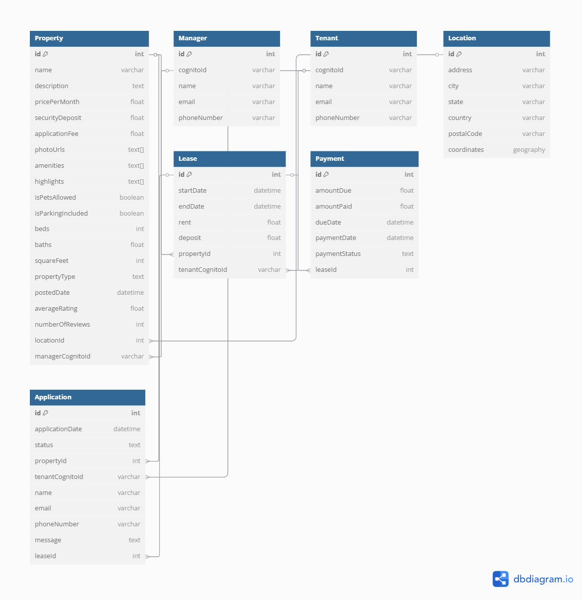
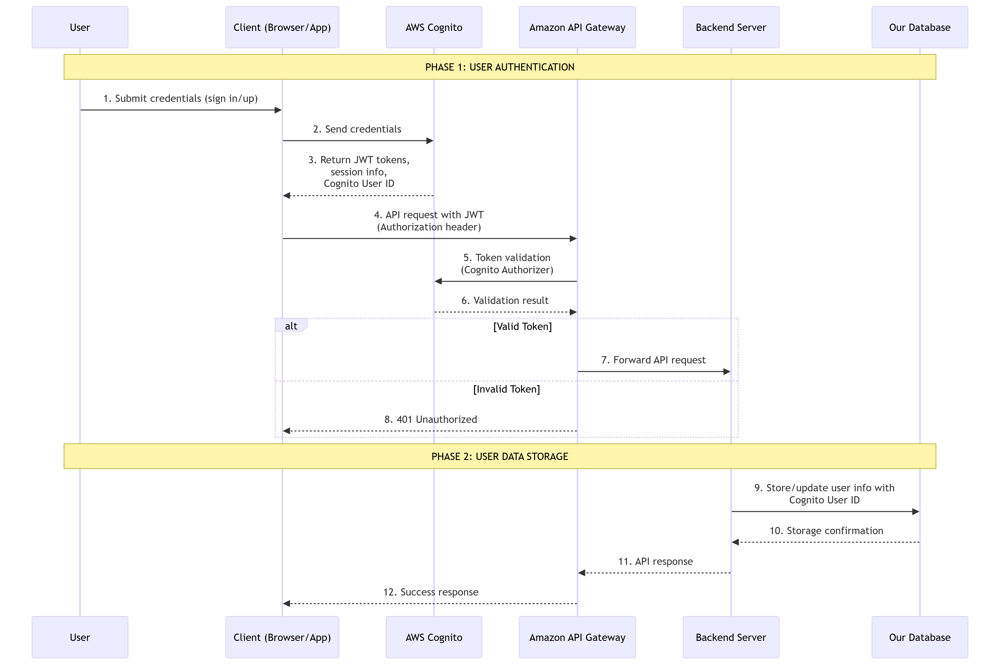

# **Rently Pro**

**A Scalable Real Estate Application**

---

## Table of Contents

- [**Rently Pro**](#rently-pro)
  - [Table of Contents](#table-of-contents)
  - [Overview](#overview)
  - [Features](#features)
  - [Technology Stack](#technology-stack)
    - [Frontend](#frontend)
    - [Backend](#backend)
    - [Authentication](#authentication)
  - [Architecture Overview](#architecture-overview)
  - [Getting Started](#getting-started)
    - [Prerequisites](#prerequisites)
    - [Installation](#installation)
  - [Useful Links](#useful-links)
    - [AWS](#aws)
    - [Frontend Resources](#frontend-resources)
    - [Backend Resources](#backend-resources)
    - [ShadCN Components](#shadcn-components)
    - [Database Entity Relationship Diagram](#database-entity-relationship-diagram)
  - [Authentication Flow](#authentication-flow)
    - [Phase 1: User Authentication](#phase-1-user-authentication)
    - [Phase 2: User Data Storage](#phase-2-user-data-storage)
  - [Contact](#contact)

---

## Overview

**Rently Pro** is an enterprise-grade, scalable real estate application designed to streamline the rental process for property managers, landlords, and tenants. Built with modern technologies such as **Next.js**, **Node.js**, and **AWS**, Rently Pro delivers a robust, secure, and user-friendly platform for managing rental properties, listings, and tenant interactions.

## Features

- **Property Listings:** Easily create, update, and manage rental property listings with rich media support.
- **Advanced Search:** Filter properties by location, price, amenities, and more using interactive maps.
- **Secure Authentication:** User registration and login powered by AWS Cognito.
- **Responsive UI:** Modern, mobile-friendly interface built with Tailwind CSS and Shadcn components.
- **Real-Time Updates:** Instant notifications and updates for property status and tenant communications.
- **File Management:** Upload and preview images and documents with FilePond integration.
- **Analytics Dashboard:** Visualize key metrics and trends for your rental business.
- **Scalable Infrastructure:** Deployed on AWS for high availability and performance.

---

## Technology Stack

### Frontend

- **Framework:** Next.js (React, SSR/SSG)
- **State Management:** Redux Toolkit, Redux Toolkit Query
- **Styling:** Tailwind CSS, Shadcn UI
- **Type Checking:** TypeScript
- **Animations:** Framer Motion
- **Forms & Validation:** React Hook Form, Zod, @hookform/resolvers
- **Maps:** Mapbox GL, Mapbox React GL
- **Utilities:** Date-fns, Lodash, Dotenv
- **File Uploads:** FilePond, React FilePond, FilePond Plugin Image EXIF Orientation, FilePond Plugin Image Preview
- **Icons:** Lucide React

### Backend

- **Runtime:** Node.js
- **Framework:** Express.js
- **Database:** PostgreSQL (with PostGIS), managed via AWS RDS
- **ORM:** Prisma
- **Cloud Infrastructure:** AWS EC2, API Gateway, S3, Amplify
- **API Testing:** Postman

### Authentication

- **User Management:** AWS Cognito
- **Amplify Integration:** Amplify UI, Amplify JS, Amplify React

---

## Architecture Overview

The application follows a modern microservices-inspired architecture, leveraging AWS services for scalability and reliability.

- **Frontend:** Deployed as a static site or SSR app via AWS.
- **Backend:** RESTful API built with Express.js, hosted on AWS EC2 behind API Gateway.
- **Database:** PostgreSQL with spatial extensions (PostGIS) for advanced geolocation queries.
- **Storage:** AWS S3 for media and document storage.
- **Authentication:** AWS Cognito for secure, scalable user management.
- **CI/CD:** Automated deployments using AWS Amplify and GitHub Actions.

---

## Getting Started

### Prerequisites

- Node.js (v16+)
- npm or yarn
- AWS Account
- PostgreSQL Database

### Installation

1. **Clone the repository:**

    ```bash
    git clone https://github.com/dipaloke/real-estate-prod.git
    ```

2. **Install dependencies:**

   ```bash
    cd client
    npm install
    or
    yarn install
    ```

3. **Configure environment variables:**
    - Copy `.env.example` to `.env` and fill in your credentials.

4. **Run the development server:**

    ```bash
    npm run dev
    # or
    yarn dev
    ```

5. **Access the application:**
    - Open [http://localhost:3000](http://localhost:3000) in your browser.

---

## Useful Links

### AWS

- ⭐ [AWS EC2 Instructions](https://github.com/ed-roh/real-estate...)
- ⭐ [AWS](https://aws.amazon.com/)
- ⭐ [AWS CLI](https://docs.aws.amazon.com/cli/latest/)
- ⭐ [AWS Billing](https://us-east-1.console.aws.amazon.com/billing/home)
- ⭐ [AWS Cognito](https://aws.amazon.com/cognito/)

**AWS Cognito Related Links:**

- [Amplify UI Docs](https://ui.docs.amplify.aws/react/components/authenticator)
- [Amplify JS Docs](https://docs.amplify.aws/javascript/tools/)
- [Amplify Cognito configuration](https://docs.amplify.aws/gen1/javascript/tools/libraries/configure-categories/)
- [Amplify React Docs](https://docs.amplify.aws/react/build-a-backend/auth/authentication/)
- [Nominatim](https://nominatim.org/release-docs/latest/)

### Frontend Resources

- ⭐ [Mapbox](https://www.mapbox.com/)
- ⭐ [Mapbox React GL](https://docs.mapbox.com/help/tutorials/use-mapbox-gl-js-with-react/)
- ⭐ [Mapbox GL](https://docs.mapbox.com/mapbox-gl-js/)
- ⭐ [Shadcn](https://ui.shadcn.com/docs)
- ⭐ [Shadcn Sonner](https://ui.shadcn.com/docs/components/sonner)
- ⭐ [Shadcn React Hook Form](https://ui.shadcn.com/docs/components/form)
- ⭐ [React Hook Form](https://react-hook-form.com/get-started)
- ⭐ [@hookform/resolvers](https://react-hook-form.com/docs/useform/#resolver)
- ⭐ [Zod](https://zod.dev/?id=table-of-contents)
- ⭐ [Redux Toolkit](https://redux-toolkit.js.org/)
- ⭐ [Redux Toolkit Query](https://redux-toolkit.js.org/rtk-query/overview)
- ⭐ [Lucide React](https://lucide.dev/docs/lucide-react/)
- ⭐ [Framer Motion](https://www.framer.com/motion/)
- ⭐ [Date-fns](https://date-fns.org/)
- ⭐ [Lodash](https://lodash.com/)
- ⭐ [FilePond](https://pqina.nl/filepond/)
- ⭐ [React FilePond](https://pqina.nl/filepond/docs/patterns/frameworks/react/)
- ⭐ [FilePond Plugin Image EXIF Orientation](https://pqina.nl/filepond/docs/api/plugins/image-exif-orientation/)
- ⭐ [FilePond Plugin Image Preview](https://pqina.nl/filepond/docs/api/plugins/image-preview/)
- ⭐ [Dotenv](https://www.npmjs.com/package/dotenv)

### Backend Resources

- ⭐ [Postgres Download](https://www.postgresql.org/download/)
- ⭐ [PostGIS Install](https://postgis.net/workshops/postgis-intro/)
- ⭐ [PgAdmin Download](https://www.pgadmin.org/download/)
- ⭐ [Prisma Docs](https://www.prisma.io/docs/getting-started)
- ⭐ [Postman Download](https://www.postman.com/downloads/)

### ShadCN Components

A rich set of UI components are used, including:

`avatar`, `badge`, `button`, `card`, `checkbox`, `command`, `dialog`, `dropdown-menu`, `form`, `input`, `label`, `navigation-menu`, `radio-group`, `select`, `separator`, `sheet`, `sidebar`, `skeleton`, `slider`, `sonner`, `switch`, `table`, `tabs`, `textarea`, `tooltip`

### Database Entity Relationship Diagram



## Authentication Flow



Flow Explanation:

### Phase 1: User Authentication

- User submits credentials through client application

- Client sends credentials to AWS Cognito

- Cognito verifies credentials and returns JWT tokens + Cognito User ID

- Client sends API requests to API Gateway with JWT in Authorization header

- API Gateway validates token using Cognito Authorizer

- Validation result returned to API Gateway

- Valid requests forwarded to backend server

- Invalid tokens rejected with 401 response (stops flow)

### Phase 2: User Data Storage

- Backend server stores/updates user information in database using Cognito User ID

- Database confirms successful storage operation

- Server sends API response through API Gateway

- Success response delivered to client

---

## Contact

For questions, support, or contributions, please contact:

- **Project Maintainer:** [Dipaloke Biswas](mailto:dipalokebiswas96@gmail.com)
- **GitHub:** [Rently Pro](github.com/dipaloke/real-estate-prod)

---

*Rently Pro is open-source and welcomes contributions from the community. Please refer to the [CONTRIBUTING.md](CONTRIBUTING.md) for guidelines. Feel free to use any portion or whole project as your necessity.*
